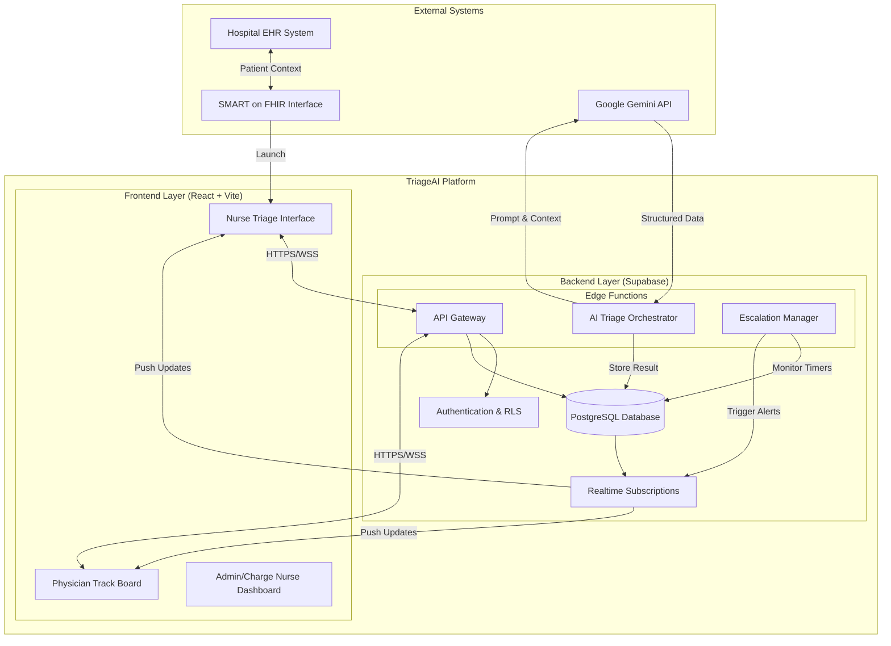
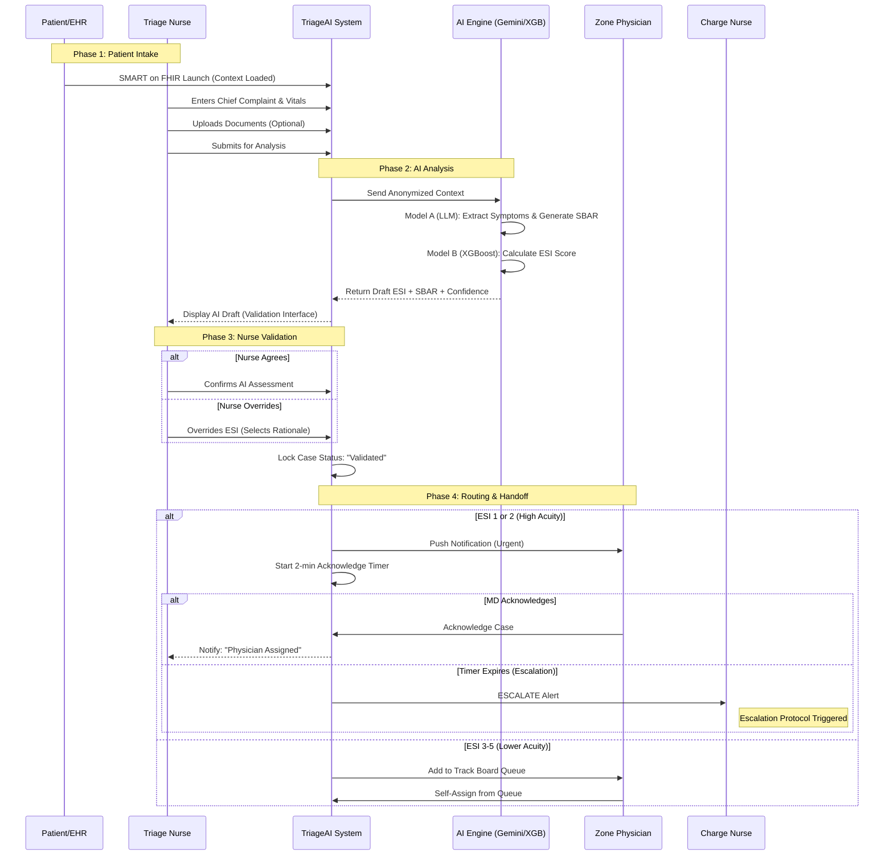
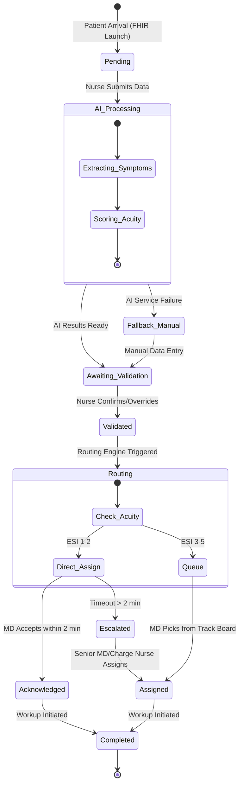
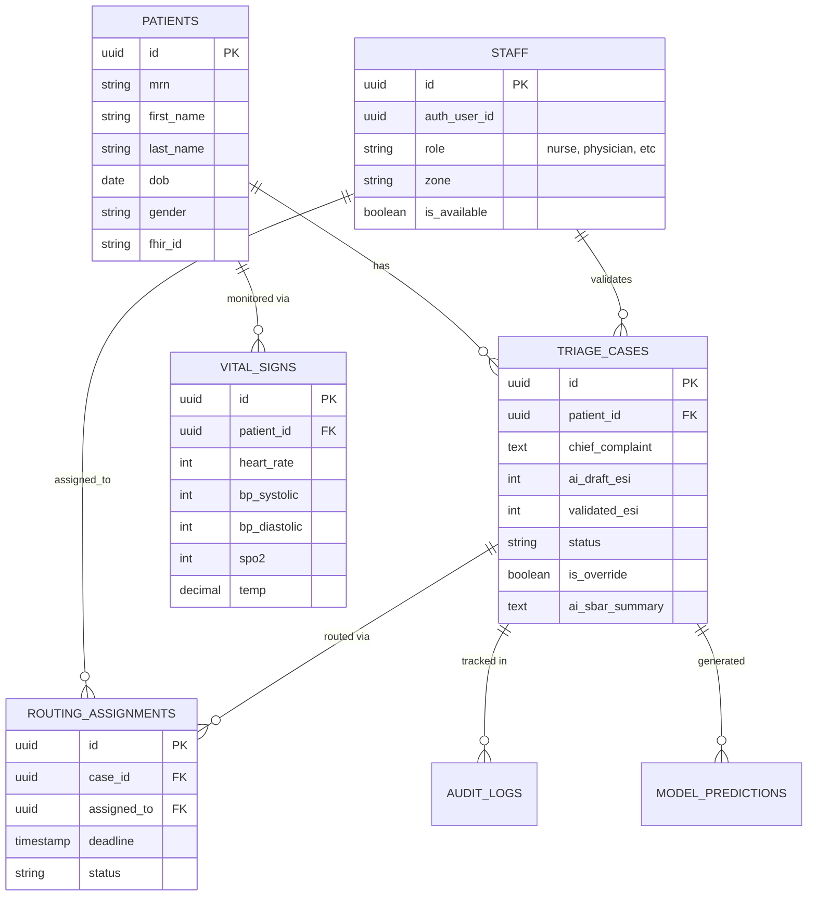

# Architecture and Workflows

## 1. System Architecture

The TriageAI system is built on a modern serverless architecture utilizing Supabase for backend services (Auth, Database, Edge Functions, Realtime) and a React-based frontend.

## 2. User Workflows

### 2.1 End-to-End Triage Journey
This sequence diagram illustrates the flow from patient arrival through AI analysis, nurse validation, and physician assignment.

## 3. Data Workflow

### 3.1 Triage Case State Machine
The lifecycle of a single patient verification case managed by the Orchestration Engine.

## 4. Database Schema (Entity Relationship)

Core operational tables in Supabase PostgreSQL.

